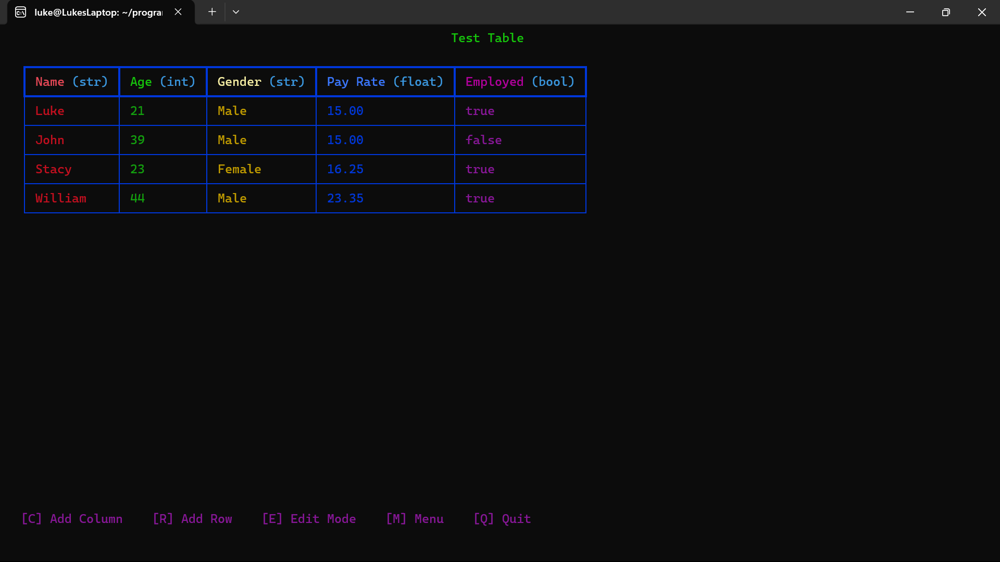

# TableCraft-C

## Background

TableCraft-C was developed as an extension module to replace the old interface for building tables in TerminalTableBuilder. It serves as a collective solution to all the limitations and usability issues of the previous interface.

## Overview

TableCraft-C is an interactive terminal-based table editor written in C, powered by ncurses and Python for flexible import/export formats. It allows you to create, edit, and save tabular data conveniently from the command line.

## Features

 - Interactive UI: Add/remove columns and rows, edit headers and cells inline.
 - Supports multiple data types: integer, float, string, boolean.
 - Color-coded interface for better readability.
 - Save your table in various formats (CSV, PDF, ODS, XLSX, JSON) via Python export scripts.
 - Rename tables and basic table metadata.
 - (Future) Load tables from CSV or other formats via Python import scripts.

## Dependencies

*These prerequisites are only required when building from source. If you download or install a prebuilt TableCraft-C binary, you can skip this step.*

- GCC (or compatible C compiler)
- ncurses (wide-character support)
- Python 3.12 (including development headers)

## Installation

*If you are using a prebuilt binary release, you can skip steps 1–3 and go directly to the [Usage](#usage) section.*

1. Install dependencies (Debian/Ubuntu):

    ```bash
    sudo apt-get update
    sudo apt-get install build-essential libncursesw5-dev python3.12 python3.12-dev
    ```

 2. Clone this repository and enter the project directory:

    ```bash
    git clone https://github.com/canadaluke888/TableCraft-c.git
    cd TableCraft-c
    ```

 3. Build the project:

    ```bash
    make
    ```

## Usage


Run the `tablecraft` executable:

```bash
./build/tablecraft
```

_Note: Python 3 must be available on your PATH for export formats (PDF, XLSX, etc.)._

### Example Screenshot


### Keybindings

 - `c` - Add a new column
 - `r` - Add a new row (requires at least one column)
 - `e` - Enter/exit editing mode (use arrow keys to navigate, Enter to edit, Esc to exit editing mode)
 - `m` - Open table menu (rename, save, load)
 - `q` - Quit the application

### Table Menu

 - `1` - Rename the current table
 - `2` - Save the table (choose output format and filename)
 - `3` - Load a table (coming soon)
 - `Q` - Cancel and return

### Save Formats

Currently, only **PDF** and **XLSX** exports are supported.
Use **1** for PDF or **2** for XLSX when prompted in the save menu.

Internally, the app still writes a temporary CSV (`tmp_export.csv`) before invoking the Python export.

## Python Export

 The `python/export.py` script handles converting the intermediate CSV to the chosen format. Ensure it is populated with the appropriate logic for each format.


## Author

 Luke Canada (<canadaluke888@gmail.com>)
