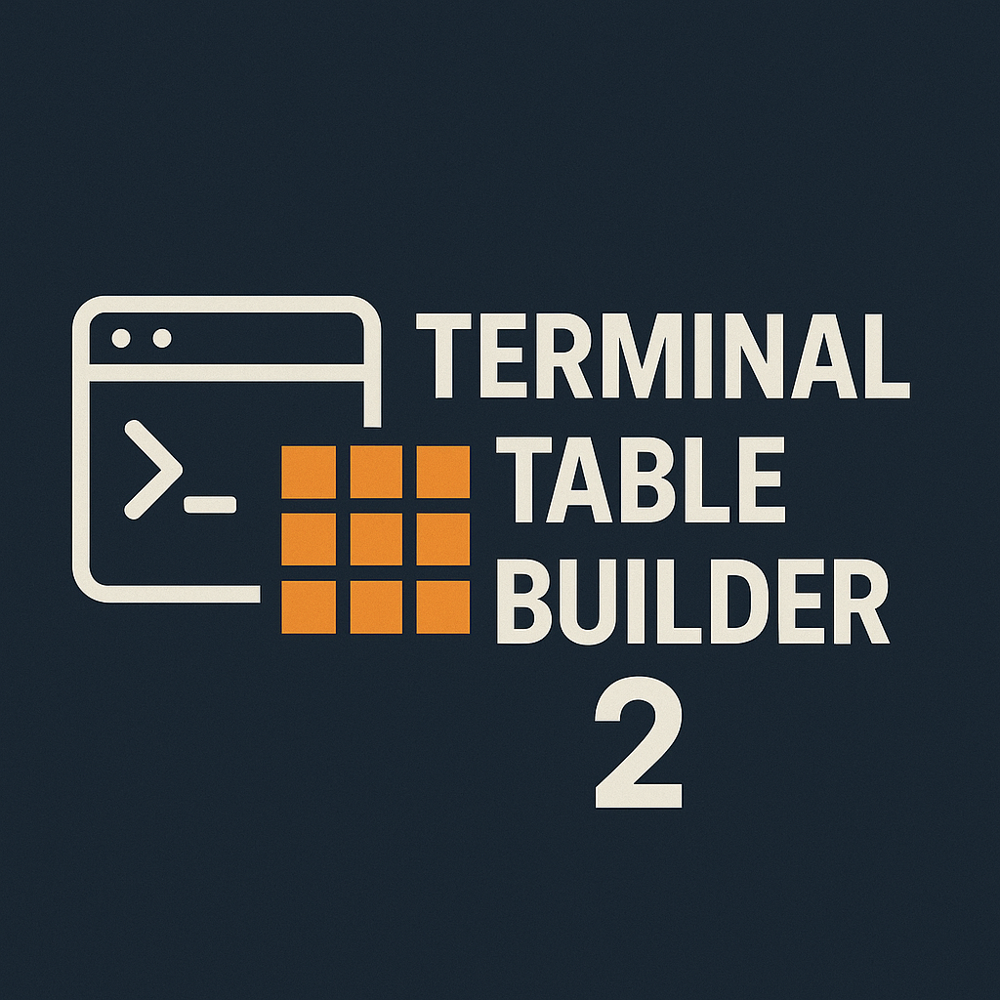
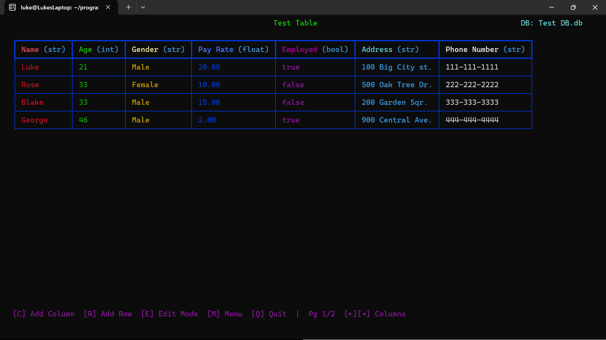
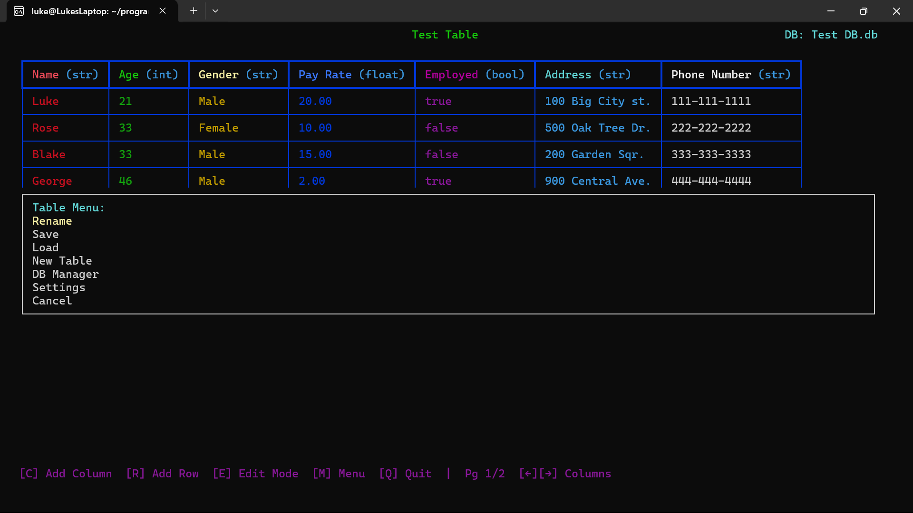
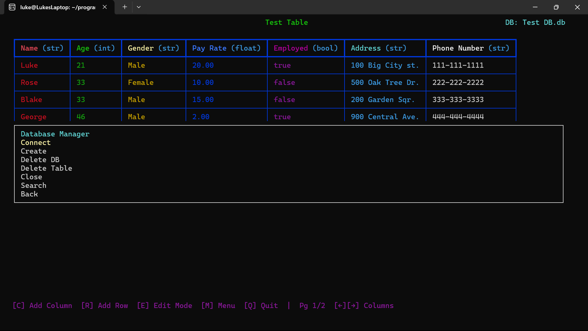
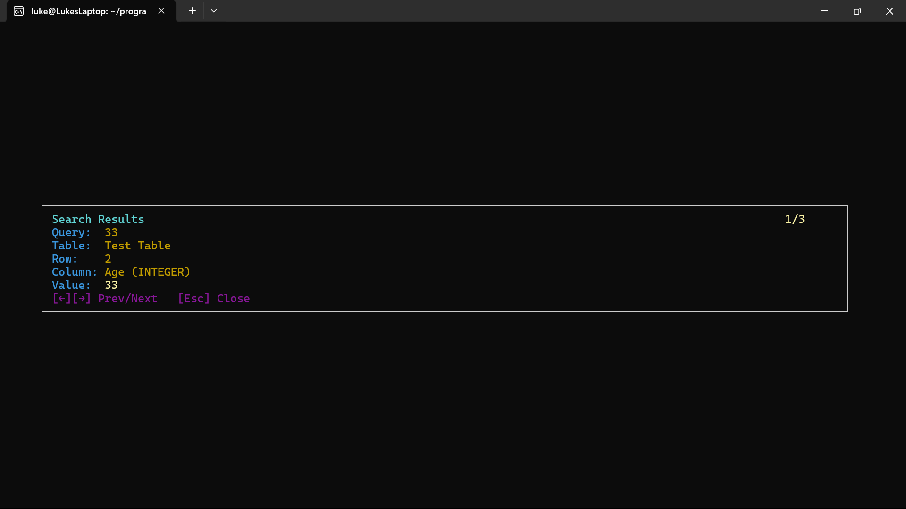

# TTB2 — Terminal Table Builder 2.0



TTB2 is the new and improved 2.0 version of the terminal table builder. It features a clean ncurses UI that displays table data live, list-based menus, an integrated SQLite database manager, autosave, paging for wide and tall tables, an inline search mode, interactive row/column deletion, and a simple JSON-backed settings system. CSV and XLSX import/export support is built in.

All of the features you're used to, just improved.

## Build

Dependencies (Debian/Ubuntu packages):
- GCC/Clang (`build-essential`) 
  `sudo apt install build-essential`
- ncurses (wide-char) (`libncursesw5-dev`) 
  `sudo apt install libncursesw5-dev`
- SQLite3 (`libsqlite3-dev`) 
  `sudo apt install libsqlite3-dev`
- JSON-C (`libjson-c-dev`) 
  `sudo apt install libjson-c-dev`
- zlib (`zlib1g-dev`)
  `sudo apt install zlib1g-dev`

Build the native binary:
```
make
```
This produces `./build/ttb2`.

Clean:
```
make clean
```

Run locally:
```
./build/ttb2
```

## Highlights
- Interactive table editing (add columns/rows; rename columns; change types; edit cells)
- Fast load and render times; smooth scrolling even on large tables
- Low‑RAM seek paging (SQLite-backed, streaming windows; no OFFSET) — toggle in Settings
- Row‑number gutter (centered, toggle in Settings)
- Data types: int, float, str, bool (color‑coded)
- Column paging with ←/→ and footer hints
- Row paging with ↑/↓
- Search mode: press F to search; navigate matches with ←/→/↑/↓; Esc exits; exact substring highlight inside the selected cell
- Edit mode tools: [x] Delete Row, [Shift+X] Delete Column (guarded), [Backspace] Clear Cell
- DB Manager: Connect/Create/Delete DB, Load Table, Delete Table, Close
- Smart sync prompts when connecting/creating DB or loading CSV with a conflicting table name
- Workspace auto-save to `.ttbx` projects (toggle via Settings, manual save with `S`)
- Settings modal (saved to `settings/settings.json`; includes type inference, Low‑RAM seek paging, row gutter)
- Exports: native CSV and XLSX save options (no external runtime required)

## Screenshots

### Main UI



### Table Menu



### Database Manager



### Searching Data



## Keybindings
- `c` Add column
- `r` Add row
- `e` Edit mode (arrows to navigate, Enter to edit, Esc to exit)
- `f` Search mode (arrows to jump matches, Esc to exit)
- `S` Save workspace project
- `Ctrl+H` Jump to top‑left (Home)
- `m` Table menu (Rename, Save, Load, New Table, DB Manager, Settings)
- In Edit mode:
  - `x` Delete row (interactive; Enter confirms)
  - `Shift+X` Delete column (interactive; Enter confirms)
  - `Backspace` Clear cell (with confirmation)
  - `Ctrl+H` Jump to top‑left (Home)
- `q` Quit

Notes:
- Terminals often report Home as `Ctrl+H`; both are shown as “Home” in the footer.

## Performance / Low‑RAM Mode
- Enable “Low‑RAM seek paging” in Settings to browse large datasets without loading everything into memory.
- Rows are fetched in small windows and rendered incrementally to keep memory and latency stable.
- On Windows terminals, flicker is minimized by double‑buffered updates and scanning only visible rows for column widths.

## Workspace & Exports
- A project workspace lives in `workspace/session.ttbx` by default. The file is created automatically and updated whenever autosave triggers or you press `S`.
- Use the Export menu to write the current data as:
  - `.ttbl` – a single-table snapshot
  - `.ttbx` – a project/workbook bundle
  - `.csv` or `.xlsx`

## CI
GitHub Actions installs build deps and runs a simple `make`; build logs are visible in the job output.

## Author
Luke Canada (<canadaluke888@gmail.com>)
