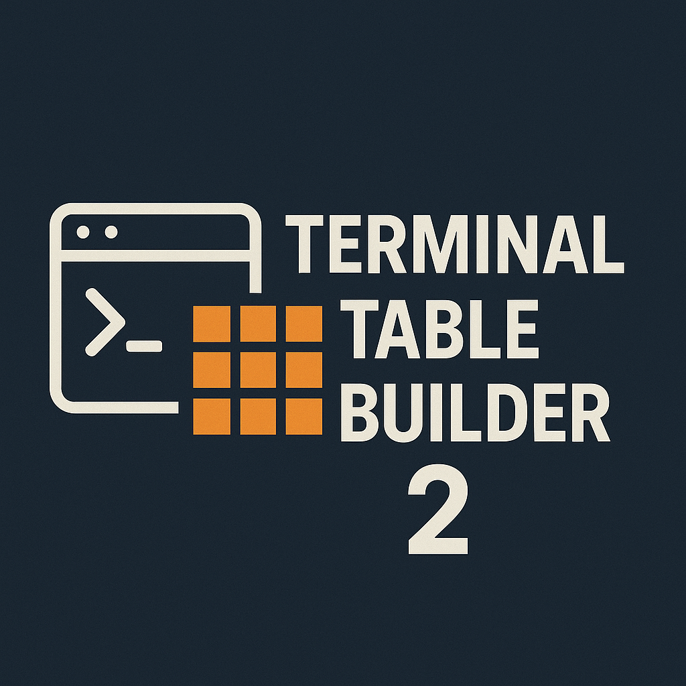
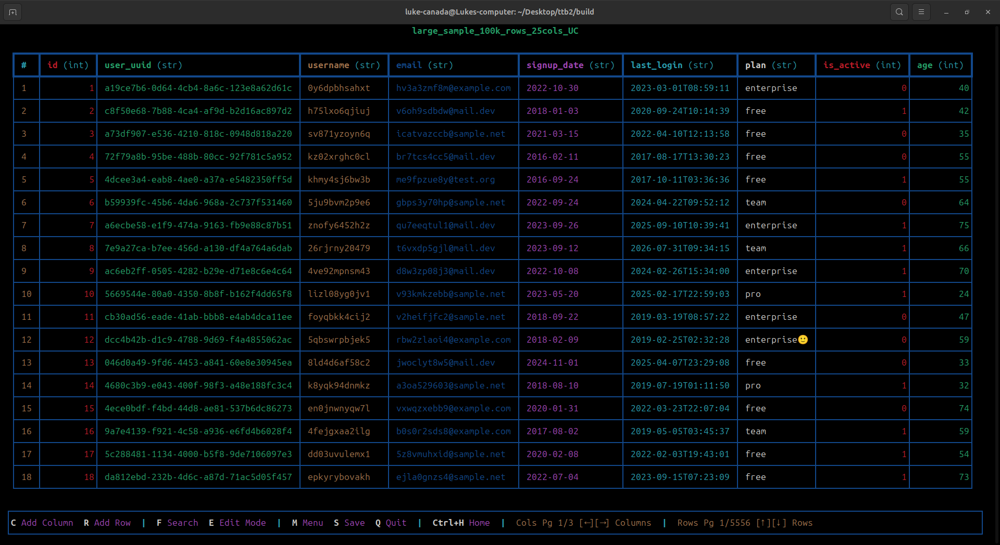
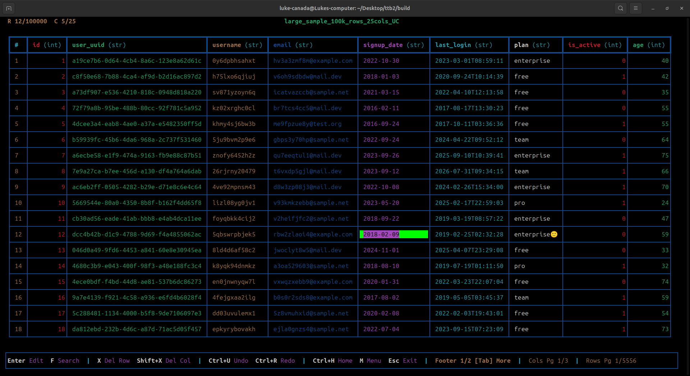
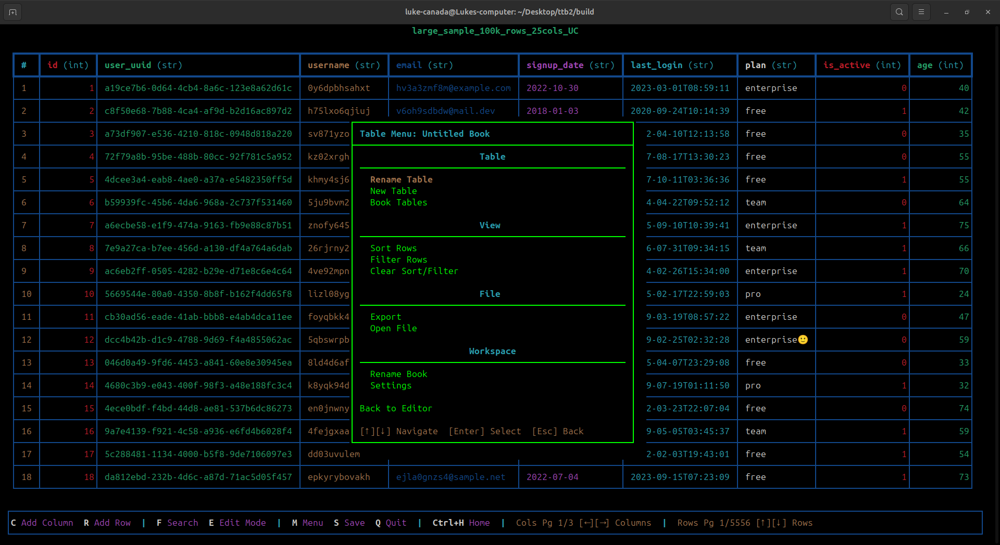

# TTB2 — Terminal Table Builder 2.0



TTB2 is the new and improved 2.0 version of the terminal table builder. It features a clean ncurses UI that displays table data live, list-based menus, autosave, paging for wide and tall tables, a hybrid ranked search mode, and interactive row/column deletion. CSV and XLSX import/export support is built in, with simple PDF export for sharing table snapshots.

All of the features you're used to, just improved.

## Install

### Debian/Ubuntu package

Go to the [latest TTB2 release](https://github.com/canadaluke888/ttb2/releases/latest) and download the `.deb` file.

Install the downloaded package:
```bash
sudo apt install ./ttb2_VERSION_ARCH.deb
```

Replace `ttb2_VERSION_ARCH.deb` with the name of the file you downloaded.

### Build from source

Install dependencies (Debian/Ubuntu packages):
- GCC/Clang (`build-essential`) 
  `sudo apt install build-essential`
- ncurses (wide-char) (`libncursesw5-dev`) 
  `sudo apt install libncursesw5-dev`
- SQLite3 (`libsqlite3-dev`) 
  `sudo apt install libsqlite3-dev`
- JSON-C (`libjson-c-dev`) 
  `sudo apt install libjson-c-dev`
- zlib (`zlib1g-dev`)
  `sudo apt install zlib1g-dev`

Build the native binary:
```
make
```
This produces `./build/ttb2`.

Install to your `PATH`:
```
sudo make install
```

Override the install prefix if needed:
```
make install PREFIX=/usr
make install DESTDIR=/tmp/package-root
```

Clean:
```
make clean
```

## Usage

```bash
ttb2
ttb2 path/to/data.csv
ttb2 path/to/data.xlsx
ttb2 path/to/table.ttbl
ttb2 path/to/book.ttbx
```

Supported startup inputs:
- `.csv`
- `.xlsx`
- `.ttbl`
- SQLite-backed `.ttbx` books
- legacy `.ttbx` directory books

## Highlights
- Interactive table editing (add columns/rows; rename columns; change types; edit cells)
- Fast load and render times; smooth scrolling even on large tables
- SQLite-backed workspace and book storage
- Row‑number gutter (centered, toggle in Settings)
- Data types: int, float, str, bool (color‑coded)
- Column paging with ←/→ and footer hints
- Row paging with ↑/↓
- Hybrid semantic search: press `F` to rank visible rows using lexical and vector signals; exact substring hits still highlight inside the selected cell
- Persisted semantic index metadata inside SQLite `.ttbx` books for faster rebuilds after save/reopen
- Edit mode tools: [x] Delete Row, [Shift+X] Delete Column (guarded), [Backspace] Clear Cell, [v] Move Row/Column, [V] Swap Row/Column
- Paged edit footer hints with `Tab` to switch between footer pages
- Workspace auto-save to `.ttbx` projects (toggle via Settings, manual save with `S`)
- Table Manager: Easily switch between tables within a book, rename, and delete tables.
- Settings modal (saved to `settings/settings.json`; includes core toggles and editor color options)
- Exports: native CSV, XLSX, and PDF save options (no external runtime required)

## Screenshots

### Main UI



### Edit Mode



### Table Menu




## Editor Keybindings
- `c` Add column
- `r` Add row
- `e` Edit mode (`W/A/S/D` or arrows to navigate, Enter to edit, Esc to exit)
- `f` Hybrid search mode (arrows to jump ranked rows, Esc to exit)
- `S` Save workspace project
- `Ctrl+H` Jump to top‑left (Home)
- `m` Table menu (Rename, Save, Load, New Table, DB Manager, Settings)
- `q` Quit

- In Edit mode:
  - `Enter` Edit cell
  - `W/A/S/D` Navigate the visible grid/page
  - `F` Search mode
  - `Ctrl+U` Undo the latest table edit
  - `Ctrl+R` Redo the latest undone table edit
  - `x` Delete row (shown as `X` in the footer; Enter confirms)
  - `Shift+X` Delete column (interactive; Enter confirms)
  - `v` Move row or column (shown as `V` in the insert footer; row when on a body row, column when on the header)
  - `V` Swap row or column (shown as `Shift+V` in the insert footer; row when on a body row, column when on the header)
  - `M` Open the table menu without leaving edit mode
  - `Tab` Cycle footer hint pages
    1. Edit Cell Content
    2. Insert/Move Rows & Columns
  - Saving a blank value while editing a cell clears that cell
  - Move row prompts for `Above` or `Below` after you pick the destination row
  - Move column prompts for `Left` or `Right` after you pick the destination column
  - `Ctrl+H` Jump to top‑left (Home)
  - `Esc` Exit edit mode

## Search and Storage
- Search ranks the current visible rows with a hybrid lexical/vector index built from column names and row values.
- Exact substring hits still win strongly and keep in-cell highlighting for the selected result.
- Semantic index metadata is stored in the active SQLite `.ttbx` workspace or exported book.
- The old seek/low‑RAM paging path has been removed; SQLite-backed books are now the single storage path.

## Workspace & Exports
- A project workspace lives in `workspace/session.ttbx` by default. The file is a SQLite-backed `.ttbx` book created automatically and updated whenever autosave triggers or you press `S`.
- Use the Export menu to write the current data as:
  - `.ttbl` – a single-table snapshot
  - `.ttbx` – a SQLite-backed project/workbook file
  - `.csv`, `.xlsx`, or `.pdf`
- Export now lets you browse to a destination directory in-app before entering the output filename.

## Runtime Files
- Settings are stored in `settings/settings.json`.
- The active workspace session book is stored in `workspace/session.ttbx` while the app is running.

## CI
GitHub Actions installs build deps and runs a simple `make`; build logs are visible in the job output.

## Author
Luke Canada (<canadaluke888@gmail.com>)
